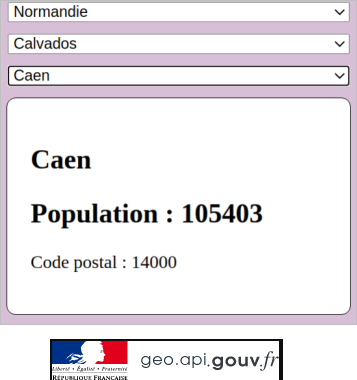

# french-territory-data-parser

## Product backlog

Formulaire Javascript intéractif composé de listes déroulantes (select->option) permettant à un internaute de sélectionner, de façon séquentielle, différents niveaux du territoire français (région, département et commune) à partir de l'API de l'état français.

- région
- département
- commune

## Contraintes techniques

Il est demander d'implémenter le formulaire avec:

- Le mécanisme des promesses combiné à la fonction Fetch
- L'évènement "onchange" sur l'objet de type élément du DOM qui correspond à la balise "select"

## Sprint

- [ ] :dart: USA001 - Remplir la liste déroulante dédiée aux régions
      Pour renseigner la première liste déroulante, vous utiliserez l'API de l'état Français.
      Endpoint : "https://geo.api.gouv.fr/regions".

- [ ] :dart: USA002 - Remplir la liste déroulante dédiée aux départements
      Une fois la région sélectionnée, l'internaute peut alors choisir via une autre liste déroulante parmi les départements correspondants.
      Endpoint : "https://geo.api.gouv.fr/regions/xx/departements.
      Nota : Il faudra remplacer xx par le numéro de la région

- [ ] :dart: USA003 - Remplir la liste déroulante dédiée aux communes
      Une fois que l'internaute a choisi un département, une liste déroulante (select) doit s'afficher avec les communes qui correspondent.
      Endpoint : "https://geo.api.gouv.fr/departements/xx/communes
      Nota : il faudra remplacer xx par le code du département

- [ ] :dart: USA004 - Afficher 3 informations concernant la commune.
      Au clic sur le nom de la commune dans la liste déroulante, l'information concernant la commune est récupérée.
      L'interface affiche alors dans la zone d'affichage dédiée :
	- le nom
	- le nombre d'habitants
	- le code postal

Endpoint : "https://geo.api.gouv.fr/communes/xxxxx"
Nota : il faut remplacer xxxxx par le code de la commune